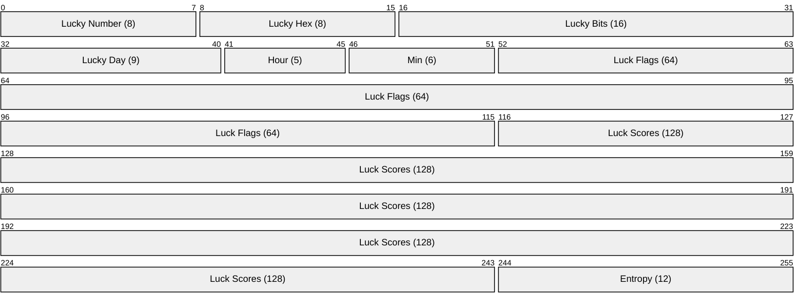

# hash-omikuji

SHA-256 based deterministic fortune telling CLI.

**This command can only be executed on January 1st!**

## Usage

```bash
npx hash-omikuji
```

### Options

- `--year <YYYY>` - Target year (default: current year)
- `--seed <string>` - Custom seed (default: device fingerprint from username@hostname)
- `--json` - Output as JSON
- `--short` - Show only top 5 luck scores
- `--show-seed` - Display seed and fingerprint
- `--force` - Execute outside January 1st (with warning)

### Example Output

```
🎍 Hash-Omikuji 2026 🎍

Lucky Number      : 165
Lucky Hex         : 0xBF
Lucky Color       : #BFA532
Lucky Bits        : 0010 0101 0011 0100

Lucky Day         : 2026-09-01 (244 / 365)
Lucky Time        : 02:40

Active Luck Flags :
✖ Life  ✖ Health  ✔ Wealth  ✔ Career  ...

Luck Scores :
WiFi Luck         :  95 (Excellent)
Study Luck        :  94 (Excellent)
...

device:a3f2b1c9 | 5fe36d472c00c87d | 0xF01
```

## How It Works

Uses SHA-256 hash of `{year}-{seed}-{salt}` to deterministically generate:

- Lucky numbers, hex, color, bits
- Lucky day and time
- 16 luck categories with scores and active flags

Same input always produces the same output.

### Bit Layout (256-bit SHA-256)



| Field | Bits | Range |
|-------|------|-------|
| Lucky Number | 0-7 (8bit) | 0-255 |
| Lucky Hex | 8-15 (8bit) | 0x00-0xFF |
| Lucky Bits | 16-31 (16bit) | display pattern |
| Lucky Day | 32-40 (9bit) | 1-365 |
| Lucky Hour | 41-45 (5bit) | 0-23 |
| Lucky Minute | 46-51 (6bit) | 0-59 |
| Luck Flags | 52-115 (64bit) | 16 ON/OFF flags |
| Luck Scores | 116-243 (128bit) | 16 × 8bit scores |
| Entropy | 244-255 (12bit) | checksum display |

## Build from Source

```bash
cd rust
cargo build --release
```

## License

MIT
